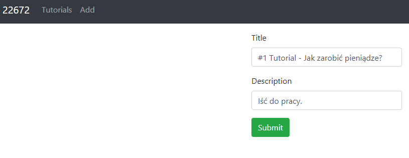
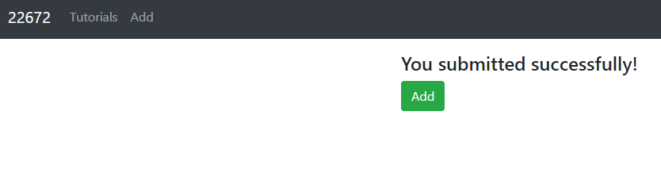
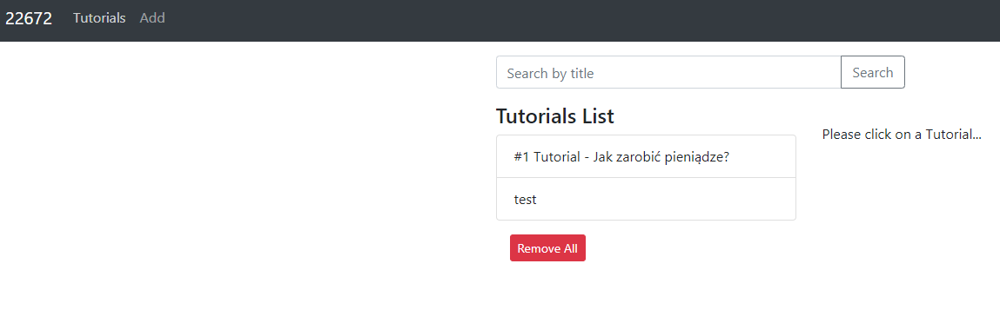
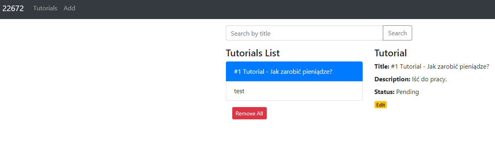
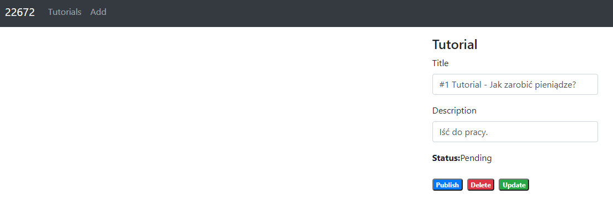
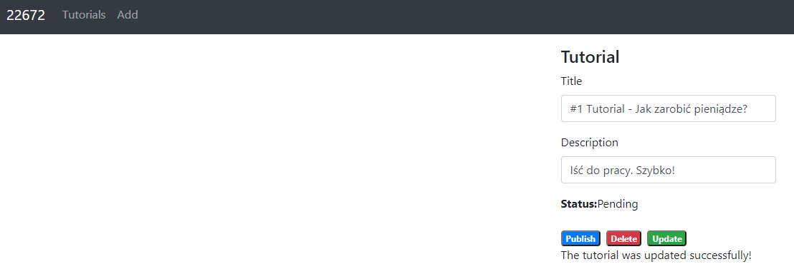
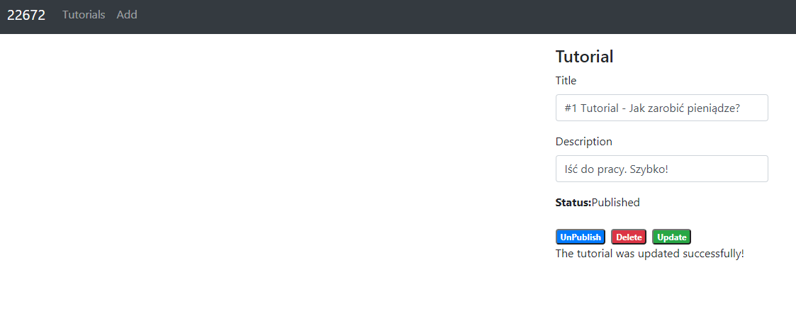
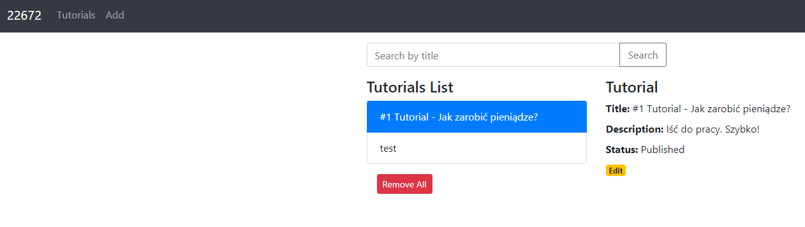
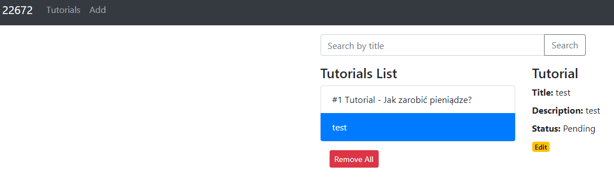
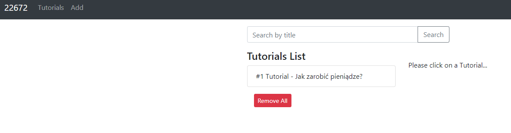

# Django + React (aplikacja CRUD)

## Strona do dodawania tutoriali

Dodawanie tutorialu do listy.

Lista tutoriali z możiwością usuwania wszystkich elementów listy.

Widok edycji tutoriali.

Publikowanie tutoriala na stronie.

Usunięcie tutoriala.

